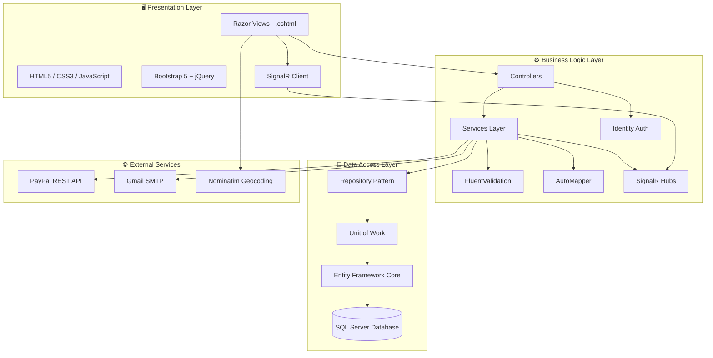
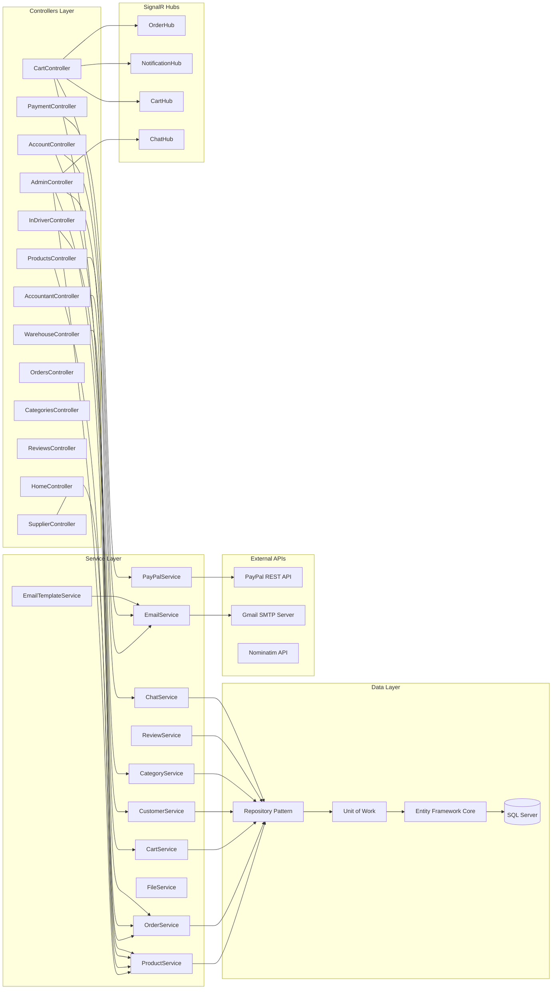
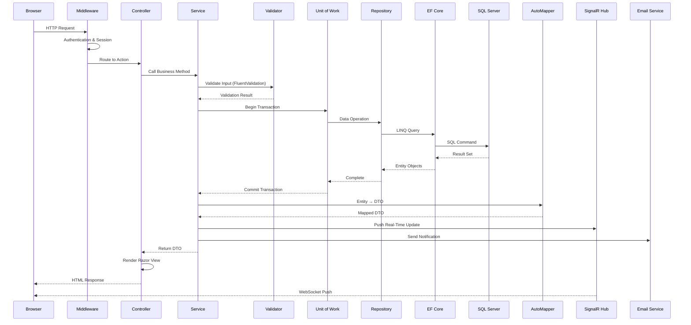
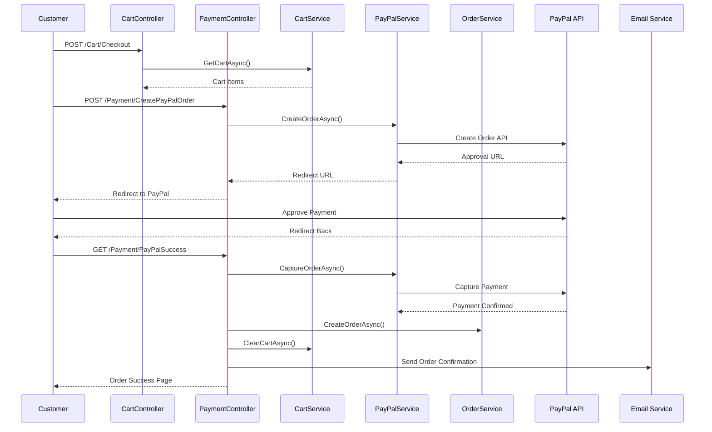
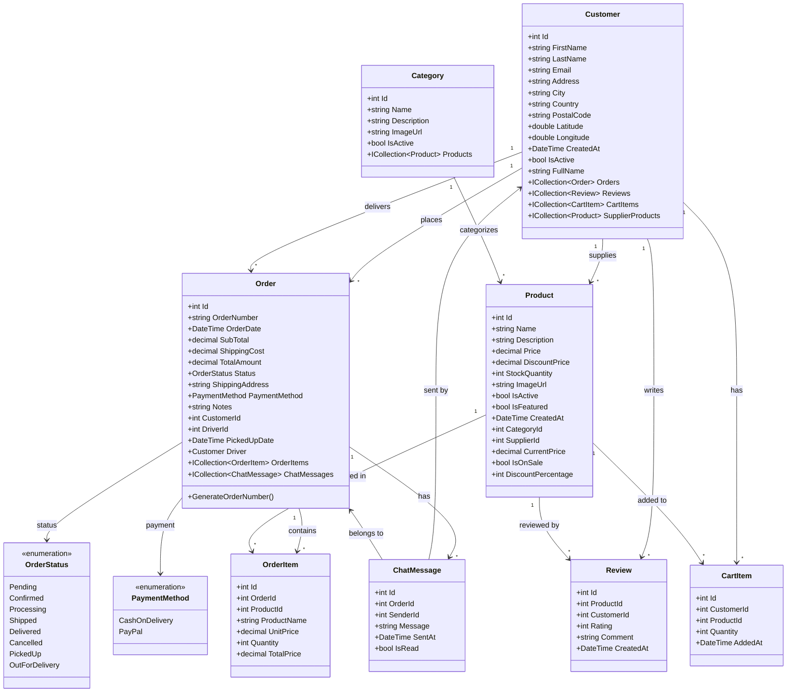
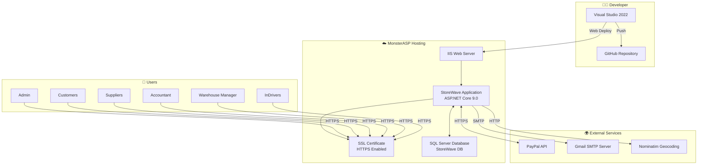

<div align="center">

# 🌊 StoreWave

### *Enterprise E-Commerce Platform*

[](https://dotnet.microsoft.com/)
[](https://www.microsoft.com/sql-server)
[](https://getbootstrap.com/)
[](https://dotnet.microsoft.com/apps/aspnet/signalr)
[](https://developer.paypal.com/)
[](LICENSE)

**A full-featured, role-based e-commerce platform built with ASP.NET Core MVC, featuring real-time notifications, PayPal payments, email automation, and a multi-role dashboard system.**

[Live Demo](https://shopmartcommerce.runasp.net) · [Report Bug](#) · [Request Feature](#)

</div>

---

## 📋 Table of Contents

- [System Overview](#-system-overview)
- [Role-Based Features](#-role-based-features)
- [System Architecture](#-system-architecture)
- [Backend Architecture & Components](#-backend-architecture--components)
- [Data Flow in Backend](#-data-flow-in-backend)
- [UML Class Diagram](#-uml-class-diagram)
- [Project Package Structure](#-project-package-structure)
- [Tools & Technologies](#-tools--technologies)
- [Hosting & Deployment](#-hosting--deployment-monsterasp)

---

## 🔭 System Overview

**StoreWave** is a comprehensive, enterprise-grade e-commerce platform built using the **ASP.NET Core 9.0 MVC** architecture. It provides a complete online shopping experience with a sophisticated multi-role management system.

### Key Highlights

| Feature | Description |
|---------|-------------|
| 🛒 **Full Shopping Experience** | Product browsing, search, filtering, cart management, and checkout |
| 💳 **PayPal Integration** | Secure online payments via PayPal REST API |
| 📧 **Email Automation** | OTP verification, order confirmations, role-based notifications via SMTP |
| 🔔 **Real-Time Updates** | Live order tracking, cart sync, and chat via SignalR WebSockets |
| 👥 **6-Role System** | Admin, Customer, Supplier, Accountant, Warehouse Manager, InDriver |
| 🗺️ **Location Services** | GPS-based address detection via Nominatim/OpenStreetMap |
| 🔒 **Security** | ASP.NET Identity with role-based authorization, anti-forgery tokens |
| 📊 **Analytics Dashboards** | Revenue reports, sales analytics, payment method statistics |

---

## 👥 Role-Based Features

StoreWave implements a granular **Role-Based Access Control (RBAC)** system with 6 distinct roles, each with dedicated dashboards and functionality:

### 🔑 Admin — *Full System Control*

| Feature | Description |
|---------|-------------|
| 📊 Dashboard | Total revenue, orders, products, customers at a glance |
| 👤 User Management | View all users, assign roles, activate/deactivate accounts |
| 📦 Order Management | View all orders, update status (Pending → Processing → Shipped → Delivered) |
| 🛍️ Product Management | Full CRUD for all products across all suppliers |
| 📂 Category Management | Create, edit, delete product categories |
| 💬 Order Chat | Real-time chat support with customers on specific orders |
| ⭐ Review Management | Monitor and manage product reviews |

### 🛒 Customer — *Shopping Experience*

| Feature | Description |
|---------|-------------|
| 🏠 Home Page | Featured products, categories, search functionality |
| 🔍 Product Browsing | Filter by category, search by name, view product details |
| 🛒 Shopping Cart | Add/remove items, update quantities, real-time cart sync |
| 💳 Checkout | Cash on Delivery or PayPal payment options |
| 📦 Order Tracking | View order history, track status, order details |
| 💬 Order Chat | Real-time chat with admin/support for specific orders |
| ⭐ Product Reviews | Rate and review purchased products |
| 👤 Profile Management | Edit personal info, shipping address, GPS location |

### 📦 Supplier — *Product Supply Management*

| Feature | Description |
|---------|-------------|
| 📊 Dashboard | Total products, active listings, out-of-stock alerts |
| 🛍️ Product Management | Create, edit, delete own products with image upload |
| 📋 Order Visibility | View orders containing their supplied products |
| 📸 Image Management | Upload and manage product images |

### 💰 Accountant — *Financial Analytics*

| Feature | Description |
|---------|-------------|
| 📊 Financial Dashboard | Total revenue, order count, average order value, today's/monthly sales |
| 📈 Sales Reports | Date-range filtered sales analysis |
| 💵 Revenue Analytics | Monthly revenue trends over 12 months |
| 💳 Payment Methods | Payment method distribution and statistics |
| 📋 Order Details | Drill-down into individual order financials |

### 🏭 Warehouse Manager — *Inventory Control*

| Feature | Description |
|---------|-------------|
| 📊 Dashboard | Total products, low stock alerts, out-of-stock count, total inventory |
| 📦 Inventory Management | Full inventory listing sorted by stock level |
| ✏️ Stock Updates | Update stock quantities for individual products |
| ⚠️ Low Stock Alerts | Products with stock ≤ 10 flagged for restocking |

### 🚚 InDriver — *Delivery Management*

| Feature | Description |
|---------|-------------|
| 📊 Dashboard | Assigned orders, in-transit count, delivered count, new orders at a glance |
| 📦 Auto-Assignment | Orders are automatically assigned to the driver with fewest active deliveries (round-robin) |
| 🔔 Real-Time Alerts | Instant SignalR notifications when a new order is assigned |
| 📋 Order Management | View assigned orders, pick up, mark out-for-delivery, confirm delivery |
| 🗺️ Delivery Progress | Visual step-by-step delivery tracker (Confirmed → PickedUp → OutForDelivery → Delivered) |
| 📜 Delivery History | Full history of completed deliveries |

---

## 🏗️ System Architecture

StoreWave follows a classic **3-Tier Architecture** separating the Presentation, Business Logic, and Data layers:


### Architecture Tiers



---

## 🔧 Backend Architecture & Components

The backend follows **Clean Architecture** principles with clear separation of concerns:



### Component Responsibilities

| Component | Role | Pattern |
|-----------|------|---------|
| **Controllers** | Handle HTTP requests, route to services | MVC Controller |
| **Services** | Business logic, validation, orchestration | Service Layer |
| **Repositories** | Data access abstraction | Repository Pattern |
| **Unit of Work** | Transaction management | Unit of Work Pattern |
| **DTOs** | Data transfer between layers | Data Transfer Object |
| **ViewModels** | View-specific data models | MVVM-inspired |
| **Validators** | Input validation rules | FluentValidation |
| **Mappings** | Entity ↔ DTO conversion | AutoMapper Profile |
| **Hubs** | Real-time bidirectional communication | SignalR Hub |

---

## 🔄 Data Flow in Backend

This diagram illustrates how data flows through the StoreWave backend when processing a request:


### Request Processing Pipeline



### Checkout Flow (PayPal)



---

## 📐 UML Class Diagram

### Core Entity Relationships



### Service Layer Interfaces

```mermaid
classDiagram
    class IProductService {
        <<interface>>
        +GetAllProductsAsync()
        +GetProductByIdAsync(id)
        +GetProductsByCategoryAsync(categoryId)
        +SearchProductsAsync(searchTerm)
        +CreateProductAsync(productDto)
        +UpdateProductAsync(productDto)
        +DeleteProductAsync(id)
    }

    class IOrderService {
        <<interface>>
        +CreateOrderAsync(userId, orderDto)
        +GetOrderByIdAsync(id)
        +GetOrdersByCustomerAsync(customerId)
        +GetOrdersByDriverAsync(driverId)
        +GetRecentOrdersAsync()
        +UpdateOrderStatusAsync(id, status)
        +AssignDriverAsync(orderId, driverId)
        +GetTotalSalesAsync()
        +GetTotalOrdersAsync()
    }

    class ICartService {
        <<interface>>
        +GetCartAsync(userId)
        +AddToCartAsync(userId, productId, qty)
        +RemoveFromCartAsync(userId, productId)
        +UpdateQuantityAsync(userId, productId, qty)
        +ClearCartAsync(userId)
        +GetCartCountAsync(userId)
    }

    class IEmailService {
        <<interface>>
        +SendEmailAsync(to, subject, body)
    }

    class IPayPalService {
        <<interface>>
        +CreateOrderAsync(request)
        +CaptureOrderAsync(orderId)
    }

    class IChatService {
        <<interface>>
        +GetMessagesAsync(orderId)
        +SendMessageAsync(message)
        +GetOrderChatsAsync()
        +MarkAsReadAsync(orderId, userId)
    }

    class IUnitOfWork {
        <<interface>>
        +Products: IProductRepository
        +Categories: ICategoryRepository
        +Orders: IOrderRepository
        +Customers: ICustomerRepository
        +CartItems: ICartItemRepository
        +Reviews: IReviewRepository
        +SaveChangesAsync()
    }
```



---

## 📁 Project Package Structure

```
📁 StoreWave/
│
├── 📁 Controllers/              # 13 MVC Controllers
│   ├── AccountController.cs         # Auth: Login, Register, OTP, Password Reset
│   ├── AdminController.cs           # Admin Dashboard, Users, Orders, Chat
│   ├── AccountantController.cs      # Financial Reports, Revenue, Sales
│   ├── CartController.cs            # Shopping Cart, Checkout
│   ├── CategoriesController.cs      # Category CRUD
│   ├── HomeController.cs            # Home Page, Privacy
│   ├── InDriverController.cs        # Driver Dashboard, Deliveries, Status Updates
│   ├── OrdersController.cs          # Customer Order History
│   ├── PaymentController.cs         # PayPal Payment Flow
│   ├── ProductsController.cs        # Product CRUD & Browsing
│   ├── ReviewsController.cs         # Product Reviews
│   ├── SupplierController.cs        # Supplier Product Management
│   └── WarehouseController.cs       # Inventory & Stock Management
│
├── 📁 Models/
│   ├── 📁 Entities/             # 8 Domain Entities
│   │   ├── Customer.cs              # User (extends IdentityUser<int>)
│   │   ├── Product.cs               # Product with pricing & stock
│   │   ├── Order.cs                 # Order with status tracking
│   │   ├── OrderItem.cs             # Line items in orders
│   │   ├── CartItem.cs              # Shopping cart entries
│   │   ├── Category.cs              # Product categories
│   │   ├── Review.cs                # Product reviews & ratings
│   │   └── ChatMessage.cs           # Real-time order chat messages
│   ├── 📁 Enums/
│   │   ├── OrderStatus.cs           # Pending → Confirmed → Processing → Shipped → PickedUp → OutForDelivery → Delivered
│   │   └── PaymentMethod.cs         # CashOnDelivery, PayPal
│   └── ErrorViewModel.cs
│
├── 📁 Views/                    # 54 Razor Views (.cshtml)
│   ├── 📁 Account/   (7)           # Login, Register, Profile, OTP, Password
│   ├── 📁 Admin/     (7)           # Dashboard, Users, Orders, Chat
│   ├── 📁 Accountant/ (5)          # Financial Reports, Revenue
│   ├── 📁 Cart/      (3)           # Cart, Checkout, Order Success
│   ├── 📁 Categories/ (5)          # CRUD Views
│   ├── 📁 Home/      (2)           # Index, Privacy
│   ├── 📁 InDriver/  (3)           # Driver Dashboard, Orders, Order Details
│   ├── 📁 Orders/    (2)           # Order History, Details
│   ├── 📁 Products/  (5)           # Catalog, CRUD Views
│   ├── 📁 Supplier/  (5)           # Dashboard, Product Management
│   ├── 📁 Warehouse/ (4)           # Inventory, Stock Updates
│   └── 📁 Shared/    (4)           # Layout, Login Partial, Error
│
├── 📁 Services/
│   ├── 📁 Interfaces/          # 11 Service Contracts
│   └── 📁 Implementations/    # 11 Service Implementations
│
├── 📁 Repositories/
│   ├── 📁 Interfaces/          # 7 Repository Contracts
│   └── 📁 Implementations/    # 7 Repository Implementations
│
├── 📁 DTOs/                     # 7 Data Transfer Objects
├── 📁 ViewModels/               # 12 View Models
├── 📁 Validators/               # 4 FluentValidation Rules
├── 📁 Hubs/                     # 4 SignalR Hubs
├── 📁 Data/                     # DbContext & Seeder
├── 📁 Mappings/                 # AutoMapper Profile
├── 📁 UnitOfWork/               # Unit of Work Pattern
├── 📁 Migrations/               # EF Core Migrations
├── 📁 wwwroot/                  # Static Files (CSS, JS, Images)
│
├── 📄 Program.cs                # Application Entry Point & DI Config
├── 📄 appsettings.json          # Configuration
├── 📄 StoreWave.csproj          # Project File
└── 📄 StoreWave.sln             # Solution File
```

---

## 🛠️ Tools & Technologies

### Backend Stack

| Technology | Version | Purpose |
|------------|---------|---------|
| **ASP.NET Core MVC** | 9.0 | Web framework & MVC pattern |
| **Entity Framework Core** | 9.0 | ORM & database migrations |
| **ASP.NET Identity** | 9.0 | Authentication & authorization |
| **SignalR** | 9.0 | Real-time WebSocket communication |
| **FluentValidation** | 11.3 | Server-side input validation |
| **AutoMapper** | 12.0 | Object-to-object mapping |
| **C#** | 13 | Primary programming language |

### Frontend Stack

| Technology | Version | Purpose |
|------------|---------|---------|
| **Razor Views** | - | Server-side HTML templating |
| **Bootstrap** | 5.3 | Responsive UI framework |
| **jQuery** | 3.7 | DOM manipulation & AJAX |
| **JavaScript** | ES6+ | Client-side interactivity |
| **CSS3** | - | Custom styling & animations |
| **Font Awesome** | 6.x | Icon library |
| **Leaflet.js** | - | Interactive maps |

### Database & Storage

| Technology | Version | Purpose |
|------------|---------|---------|
| **SQL Server** | 2022 | Relational database |
| **EF Core Migrations** | - | Database schema versioning |
| **Redis** *(optional)* | - | Distributed caching |

### External Services & APIs

| Service | Purpose |
|---------|---------|
| **PayPal REST API** | Online payment processing |
| **Gmail SMTP** | Transactional email delivery |
| **Nominatim API** | Reverse geocoding & address lookup |
| **OpenStreetMap** | Interactive location maps |

### Development Tools

| Tool | Purpose |
|------|---------|
| **Visual Studio 2022** | Primary IDE |
| **Git & GitHub** | Version control |
| **Postman** | API testing |
| **SQL Server Management Studio** | Database management |
| **NuGet** | Package management |

---

## 🌐 Hosting & Deployment (MonsterASP)

StoreWave is deployed on **MonsterASP.NET** hosting platform:


### Deployment Architecture



### Hosting Configuration

| Parameter | Value |
|-----------|-------|
| **Provider** | MonsterASP.NET |
| **Runtime** | ASP.NET Core 9.0 |
| **Web Server** | IIS (Internet Information Services) |
| **Database** | SQL Server on MonsterASP |
| **Domain** | `shopmartcommerce.runasp.net` |
| **Protocol** | HTTPS with SSL |
| **Deployment** | Web Deploy from Visual Studio |

### Deployment Steps

1. **Build** the project in Release mode:
   ```bash
   dotnet publish -c Release
   ```
2. **Configure** the production connection string in `appsettings.json`
3. **Deploy** via Web Deploy or FTP to MonsterASP server
4. **Run Migrations** automatically on first startup via `context.Database.Migrate()`
5. **Seed Data** — roles and admin account are auto-created by `DbSeeder`

---

## 🚀 Getting Started (Local Development)

### Prerequisites

- [.NET 9.0 SDK](https://dotnet.microsoft.com/download)
- [SQL Server](https://www.microsoft.com/sql-server) (LocalDB or Express)
- [Visual Studio 2022](https://visualstudio.microsoft.com/) or VS Code

### Setup

```bash
# Clone the repository
git clone https://github.com/your-repo/StoreWave.git

# Navigate to project
cd StoreWave

# Restore packages
dotnet restore

# Update connection string in appsettings.json
# Server=.\SQLEXPRESS04;Database=StoreWave;Trusted_Connection=True;

# Run the application
dotnet run
```


<div align="center">

### Built with ❤️ by the StoreWave Engineering Team

**[⬆ Back to Top](#-storewave)**

</div>
